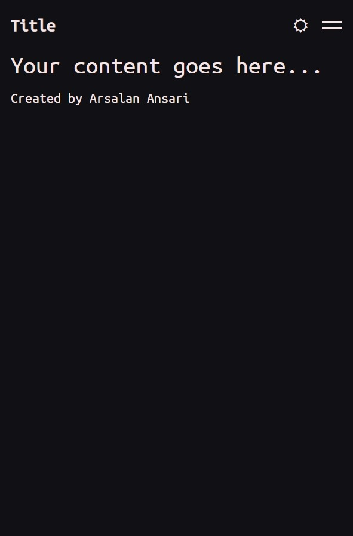
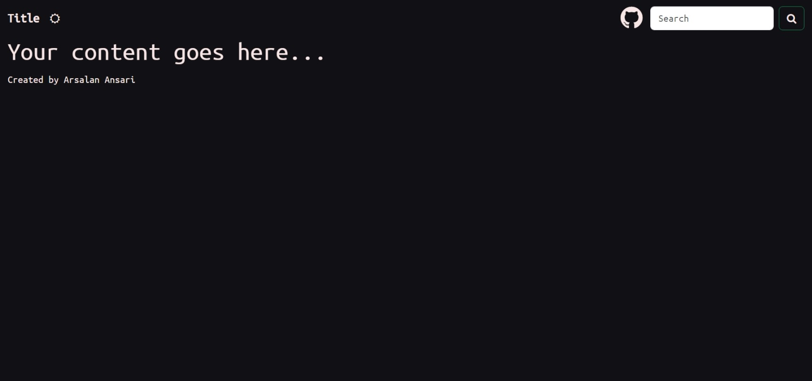

### The Ansari Weather

Project based on **Next.js**, it provides an interface for fetching weather data.

### Pre Requisites

- **Node.js** version **21** or greater.

### Dependencies used by the project

1.  **next**.
2.  **react**.
3.  **react-dom**.
4.  **bootstrap**.
5.  **font-awesome**.

### Available scripts

1. `npm run dev` for running the application in local environment.

1. `npm run start` for running the application in production environment.

1. `npm run build` for building the application for production environment.

1. `npm run auto-build` for building and running the application in production environment while detecting local changes.

### Required environment variables

1. Specify any environment variables in `.env.local` not uploaded to github.

### Instructions

Here are some screen shots of the template.

1. Home Page Mobile.   

2. Home Page Desktop.   
